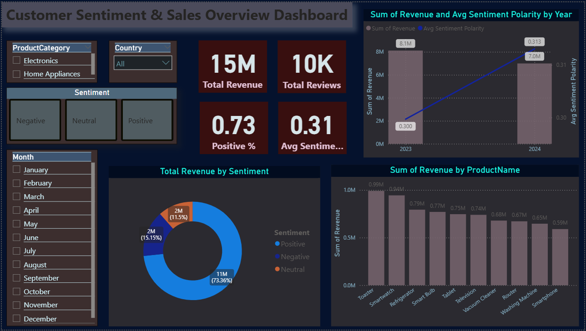
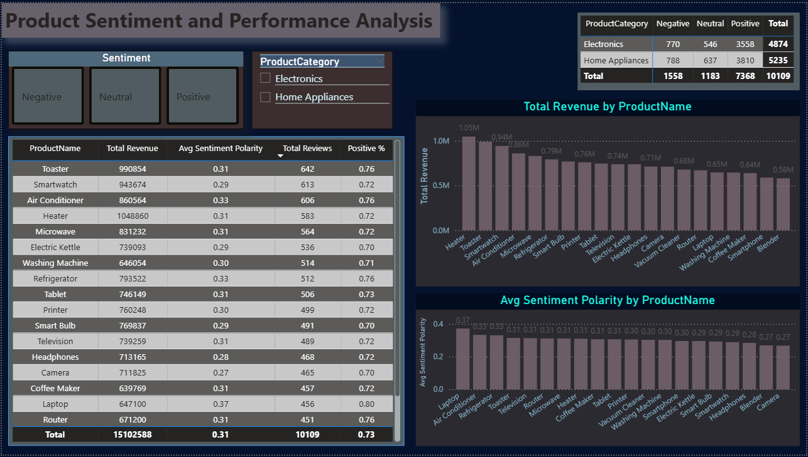
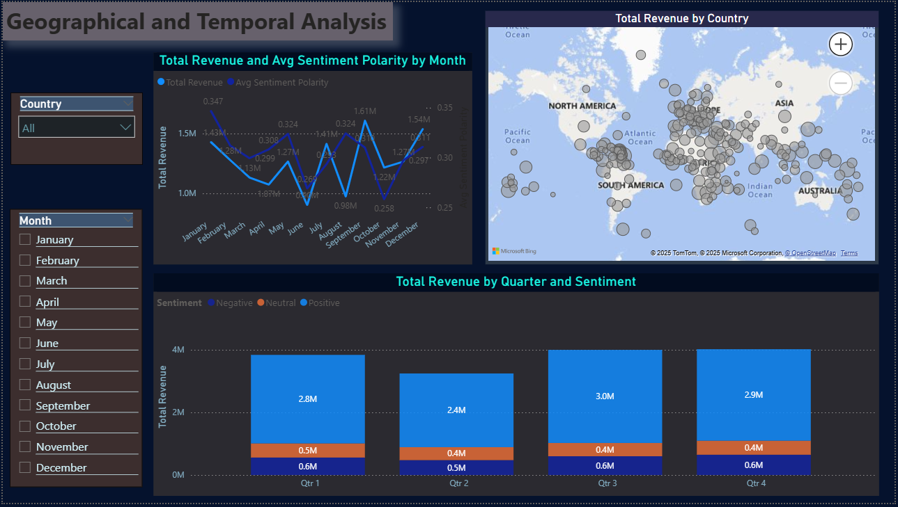

<h1>📊 Customer Sentiment & Sales Correlation Dashboard</h1>

<h2>🔍 Project Overview</h2>

The Customer Sentiment & Sales Correlation Dashboard is a data analytics project that analyzes how customer sentiment extracted from reviews impacts sales revenue across different products, time periods, and geographical regions.

This project integrates Python-based data processing with Power BI dashboards to transform raw customer data into meaningful business insights.

<h2>🎯 Project Objectives</h2>
•  Analyze customer sentiment (Positive, Neutral, Negative)
•  Understand the relationship between sentiment and revenue
•  Identify top-performing products based on sentiment
•  Analyze sales trends over time and across regions
•  Support data-driven business decisions

<h3>🗂 Dataset Used</h3>

•  customer_purchase_data.csv
•  customer_reviews_data.csv
•  merged_customer_sentiment_sales.csv

<h4>Dataset Contains:</h4>
•  Product Name & Category
•  Country & Month
•  Revenue
•  Customer Reviews
•  Sentiment Label (Positive / Neutral / Negative)
•  Sentiment Polarity Score

<h3>🛠 Tools & Technologies</h3>

•  Python (Pandas, NumPy) – Data cleaning, merging & preprocessing
•  Power BI – Dashboard creation & analysis
•  DAX – Measures & KPIs
•  CSV / Excel – Data storage

<h3>📐 DAX Measures Used</h3>

•  Total Revenue = SUM('merged_customer_sentiment_sales'[Revenue])

•  Total Reviews = COUNTROWS('merged_customer_sentiment_sales')

•  Avg Sentiment Polarity = AVERAGE('merged_customer_sentiment_sales'[Polarity])

•  Positive Reviews = CALCULATE(COUNTROWS('merged_customer_sentiment_sales'),'merged_customer_sentiment_sales'[Sentiment] = "Positive")

•  Negative Reviews = CALCULATE(COUNTROWS('merged_customer_sentiment_sales'),'merged_customer_sentiment_sales'[Sentiment] = "Negative")

•  Positive % = DIVIDE([Positive Reviews], [Total Reviews], 0)

•  Revenue Per Review = DIVIDE([Total Revenue], [Total Reviews], 0)

<h2>📊 Dashboard 1: Customer Sentiment & Sales Overview</h2>

<h3>🔑 Key Insights</h3>

•  Total Revenue: 15M
•  Total Reviews: 10K
•  Positive Reviews: 73%
•  Revenue increased from 2023 to 2024, aligned with improved sentiment
•  Positive sentiment contributes over 70% of total revenue

<h3>📌 Visuals Included</h3>

•  KPI Cards (Revenue, Reviews, Avg Sentiment)
•  Revenue vs Avg Sentiment by Year
•  Revenue Distribution by Sentiment
•  Revenue by Product Name
•  Filters for Category, Country, Month, and Sentiment

<h2>📊 Dashboard 2: Product Sentiment & Performance Analysis</h2>

<h3>🔍 Dashboard Explanation</h3>

This dashboard focuses on product-level analysis, highlighting how sentiment affects individual product performance.

<h3>🔑 Key Insights</h3>

•  Home Appliances generate higher revenue than Electronics
•  Products like Toaster, Smartwatch, Heater perform consistently well
•  Laptop has the highest average sentiment polarity
•  Products with higher positive sentiment generally receive more reviews and revenue

<h3>📌 Visuals Included</h3>

•  Product-wise Revenue & Sentiment Table
•  Revenue by Product Name (Bar Chart)
•  Avg Sentiment Polarity by Product
•  Sentiment distribution by Product Category

<h2>📊 Dashboard 3: Geographical & Temporal Analysis</h2>

<h3>🔍 Dashboard Explanation</h3>

This dashboard analyzes sales and sentiment trends across time and geography.

<h3>🔑 Key Insights</h3>

•  Q3 and Q4 show the highest revenue contribution
•  September and December are peak months for sales
•  Monthly sentiment polarity trends closely follow revenue patterns
•  North America and Asia contribute the highest revenue globally

<h3>📌 Visuals Included</h3>

•  Monthly Revenue vs Avg Sentiment Trend
•  World Map showing Revenue by Country
•  Quarterly Revenue split by Sentiment

<h3>📈 Overall Insights Summary</h3>

•  Positive sentiment has a strong correlation with higher revenue
•  Products with higher engagement (reviews) perform better
•  Seasonal trends significantly affect sales and sentiment
•  Neutral sentiment still contributes a substantial portion of revenue
•  Regional demand patterns influence overall performance

<h3>🚀 Future Enhancements</h3>

•  Real-time sentiment analysis using APIs
•  Advanced NLP models (BERT / Transformers)
•  Customer segmentation & churn analysis
•  Predictive sales forecasting
•  Live database integration

✅ This project demonstrates strong skills in data analytics, sentiment analysis, Power BI, DAX, and business storytelling.

